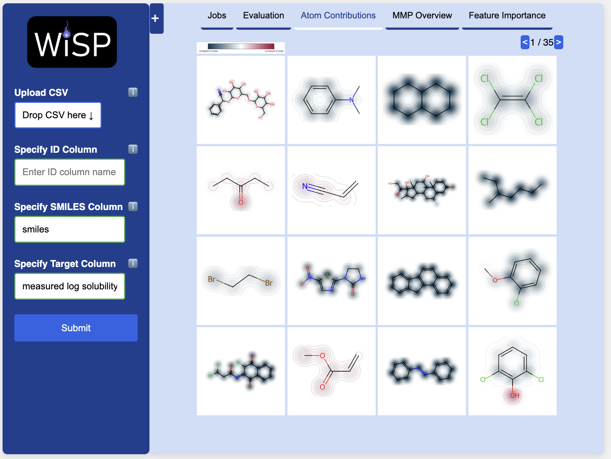

# WISP - (Workflow for Interpretability Scoring using matched molecular Pairs)

<p align="center">
    
</p>
<be>

WISP enables the quantitative evaluation of explainability methods applied to machine learning models. Details of the workflow are described in the following papers:
* [When Machine Learning Models Learn Chemistry I: Quantifying Explainability with Matched Molecular Pairs]()
* [When Machine Learning Models Learn Chemistry II: Applying WISP to Real-World Examples]()

**Try out WISP in your browser — no installation required:**

<p align="center">
    <a href="http://www.molecularxai-lab.com/" target="_blank">
        
    </a>
</p>

<p align="center">
    <a href="http://www.molecularxai-lab.com/" target="_blank"><strong>Launch the WISP Web App</strong></a>
</p>

The web application provides an interactive interface to explore explainability methods and quantitatively evaluate their performance — no prior coding knowledge required.

# Requirements for the Python Version
* python=3.11.11
* scikit-learn==1.6.1
* chemprop==2.2.0
* torch==2.7.1
* mmpdb==2.1
* rdkit==2024.9.6
* shap==0.47.2

# Installation

WISP is directly installable from GitHub:

```
pip install git+https://github.com/kerjans/ml-XAI.git
```

Or, if you want to clone the repository for development:

```
git clone https://github.com/kerjans/ml-XAI.git
cd ml-XAI
pip install -e .
git checkout code-paper-version-1
```

# Usage

We have provided different [notebooks](https://github.com/kerjans/ml-XAI/tree/main/notebooks) to:
* [Reproduce the publications](https://github.com/kerjans/ml-XAI/blob/main/notebooks/Reproduce-Paper.ipynb)
* See how [WISP is being used](https://github.com/kerjans/ml-XAI/blob/main/notebooks/examples_wisp.ipynb) and
* Explore how the [atom attributor is used](https://github.com/kerjans/ml-XAI/blob/main/notebooks/examples_atom_attributor.ipynb) as a standalone tool.

In general, you can execute WISP by simply plugging in your dataset of interest:
```python
wisp = WISP('working-dir-path',
     'dataset-path',
     'ID-column-name',
     'smiles-column-name', 
     'property-of-interest-column-name',
     model_available=None)
```

# Citations
Please acknowledge this work by citing the following if you use the package:

[When Machine Learning Models Learn Chemistry I: Quantifying Explainability with Matched Molecular Pairs]():
```
@misc{jans2025wisp1,
      title={When Machine Learning Models Learn Chemistry I: Quantifying Explainability with Matched Molecular Pairs}, 
      author={Kerrin Janssen, Jan M. Wollschläger, Jonny Proppe and Andreas H. Göller},
      year={2025},
      eprint={},
      archivePrefix={},
      primaryClass={},
      url={}, 
}
```
[When Machine Learning Models Learn Chemistry II: Applying WISP to Real-World Examples]():
```
@misc{jans2025wisp2,
      title={When Machine Learning Models Learn Chemistry II: Applying WISP to Real-World Examples}, 
      author={Kerrin Janssen, Jan M. Wollschläger, Jonny Proppe and Andreas H. Göller},
      year={2025},
      eprint={},
      archivePrefix={},
      primaryClass={},
      url={}, 
}
```

